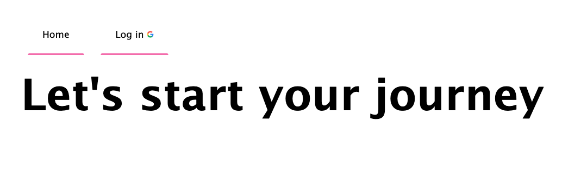
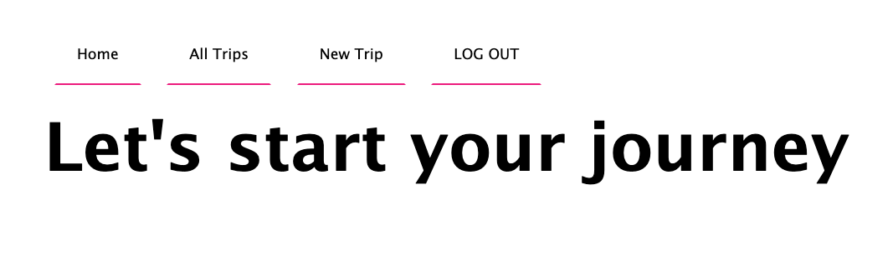

  

# Travel App

#### Natasha Rodic

## 📝 Description

 

Introducing Travel Planner App, the perfect solution for effortless trip organization and packing. With easy trip setup and customizable packing lists, you can tailor your plans to fit any journey, whether it's a business trip or a family vacation. Check off items as you pack, ensuring nothing gets left behind.

---

## 📸 Wireframes

    
Wireframes

   
   ## Screen 1

---

## Screen 2

### Home Page (Logged Out)

### Home Page (Logged In)

---

## 💻 Technologies used

- JavaScript
- HTML
- CSS
- Git/Github
- Node.js
- Express.js
- MongoDb and Mongoose

---

## User Stories

---

## Next Steps

---
