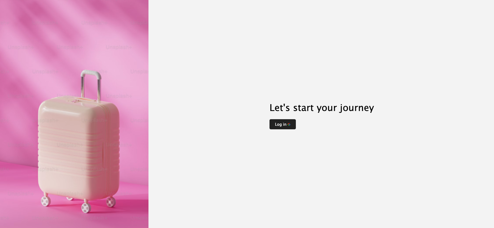
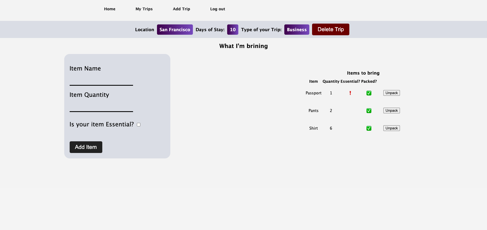

  

# Travel App

#### Natasha Rodic

## 📝 Description

 

The Travel App is a user-centric CRUD application built using Express.js and MongoDB (Mongoose). It incorporates Google OAuth Authentication for streamlined login access. The app aims to simplify the packing process and trip planning. Its main functionality revolves around enabling users to create trip cards with details such as location, duration of stay, and trip type. Once a trip is saved, users can create a checklist of items, conveniently displayed on the right side of the screen.

---

### Features

- User-centric CRUD operations
- Google OAuth Authentication for seamless login
- Trip card creation with location, duration, and trip type details
- Interactive checklist for tracking packed and unpacked items

### Landing Page

### Trip Details

---

## 💻 Technologies used

- JavaScript
- HTML
- CSS
- Git/Github
- Node.js
- Express.js
- MongoDb and Mongoose

---

## Getting Started

#### [Travel App](https://travel-plan-app-91ce82dc98aa.herokuapp.com/trips/661849c7e4a54b648ed8b76c) - Link to the deployed app on Heroku.

#### [Trello Board](https://trello.com/invite/b/9e9IhpfR/ATTId8bc2c7cf89c2382fbfac42167e170056DE7DC94/travel-app) - Link to the Trello board with the user stories and wireframes.

## Next Steps

---

- Implement download option for checklist
- Implement weather API
